<h1 align="center">Hey there, I'm Jonas</h1>

  <b>Software Development</b> | <b>Philippians 4:13 </b> | <b> Think Twice Code Once</b>

  
  
  

---

## 🚀 About Me

- 🎓 BSIT graduate from Colegio de Montalban, currently pursuing a Master of Science in Information Technology at LCUP. Passionate about building real-world systems that solve real-world problems.
- 🧠 I love solving problems with code—from web systems to IoT devices
- 🔭 Currently exploring AI integration in automation projects
- 💬 Let’s talk about Web Development and IoT projects 😎

---

## 🧰 Tech Stack

  
  
  
  
  
  
  
  
  
  
  
  

---

## 🛠️ Featured Applications
<table>
  <tr>
    <td align="center">
      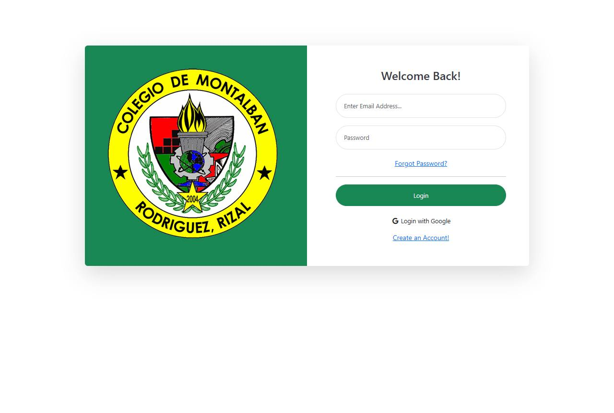 
      <strong>🎓 Admission Exam System</strong>
    </td>
    <td align="center">
      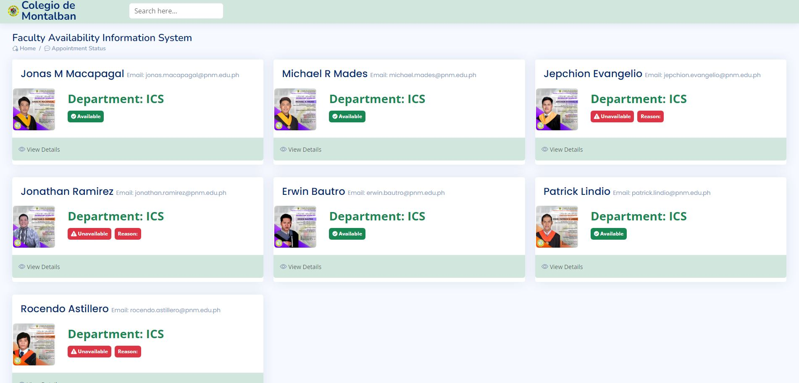 
      <strong>👨‍🏫 Faculty Availability System</strong>
    </td>
    <td align="center">
      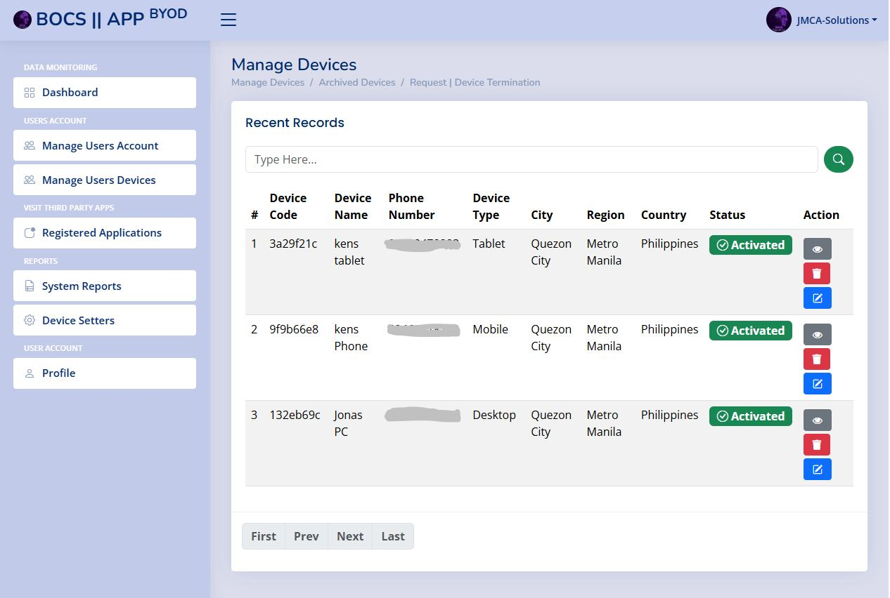 
      <strong>📱 BYOD System</strong>
    </td>
  </tr>
  <tr>
    <td align="center">
      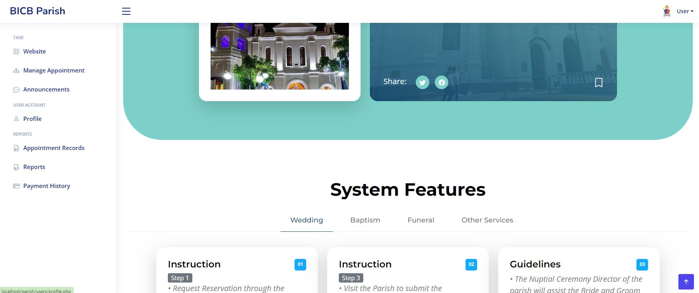 
      <strong>⛪ Parish Information System</strong>
    </td>
    <td align="center">
      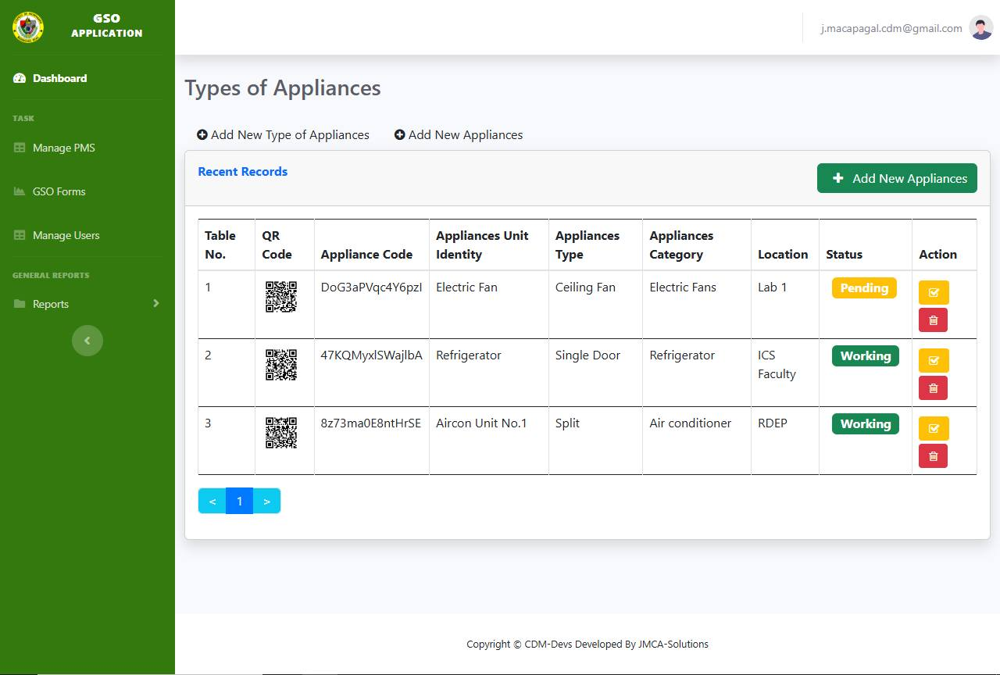 
      <strong>🏢 General Services Office System</strong>
    </td>
    <td align="center">
      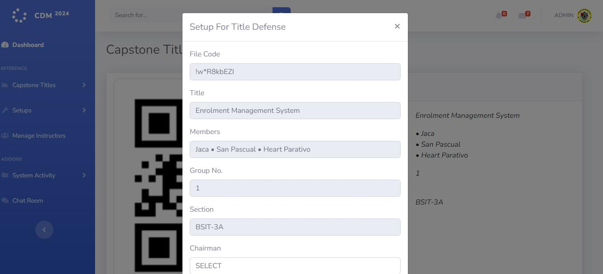 
      <strong>🗂️ Title Defense Tracker App</strong>
    </td>
  </tr>
  <tr>
    <td align="center">
      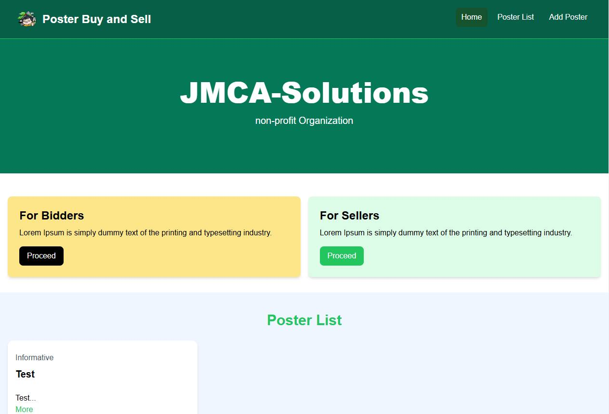 
      <strong>📊📁 Portrait Selling App</strong>
    </td>
    <td align="center">
      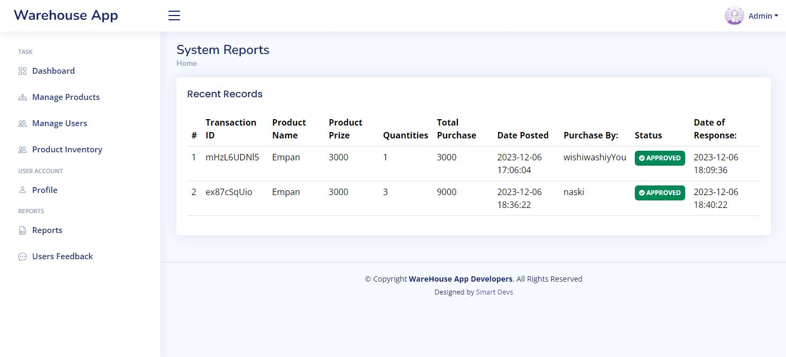 
      <strong>📦Warehouse Management System</strong>
    </td>
    <td align="center">
      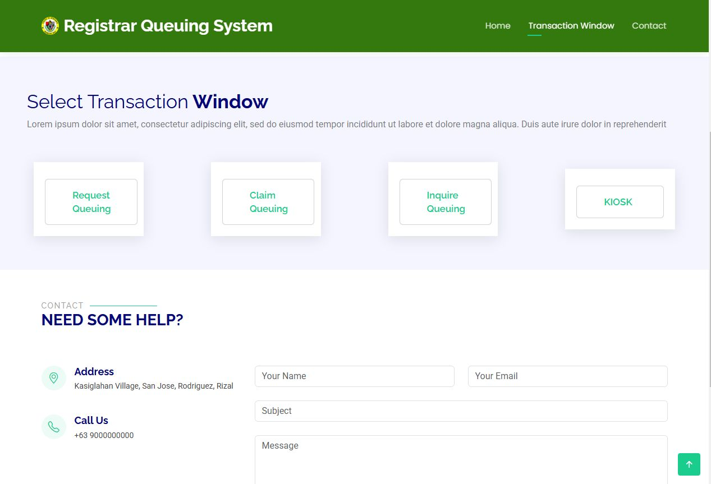 
      <strong>📊Registrar Queueing App</strong>
    </td>
  </tr>
  <tr>
    <td align="center">
      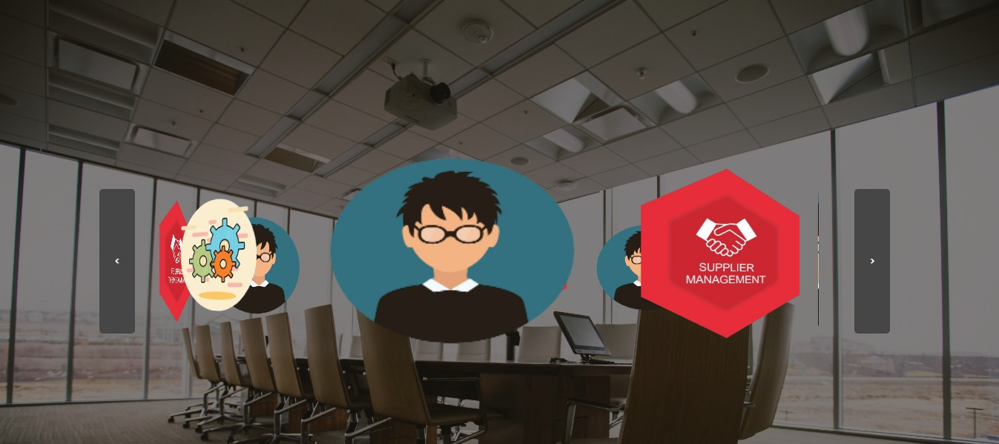 
      <strong>☕Deja Brew App</strong>
    </td>
    <td align="center">
      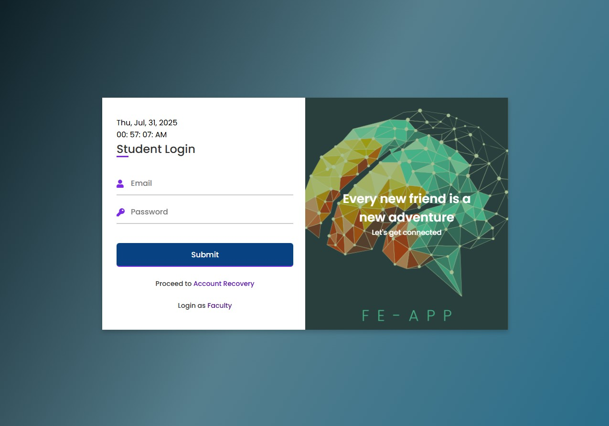 
      <strong>📊📁 Faculty Evaluation System</strong>
    </td>
    <td align="center">
      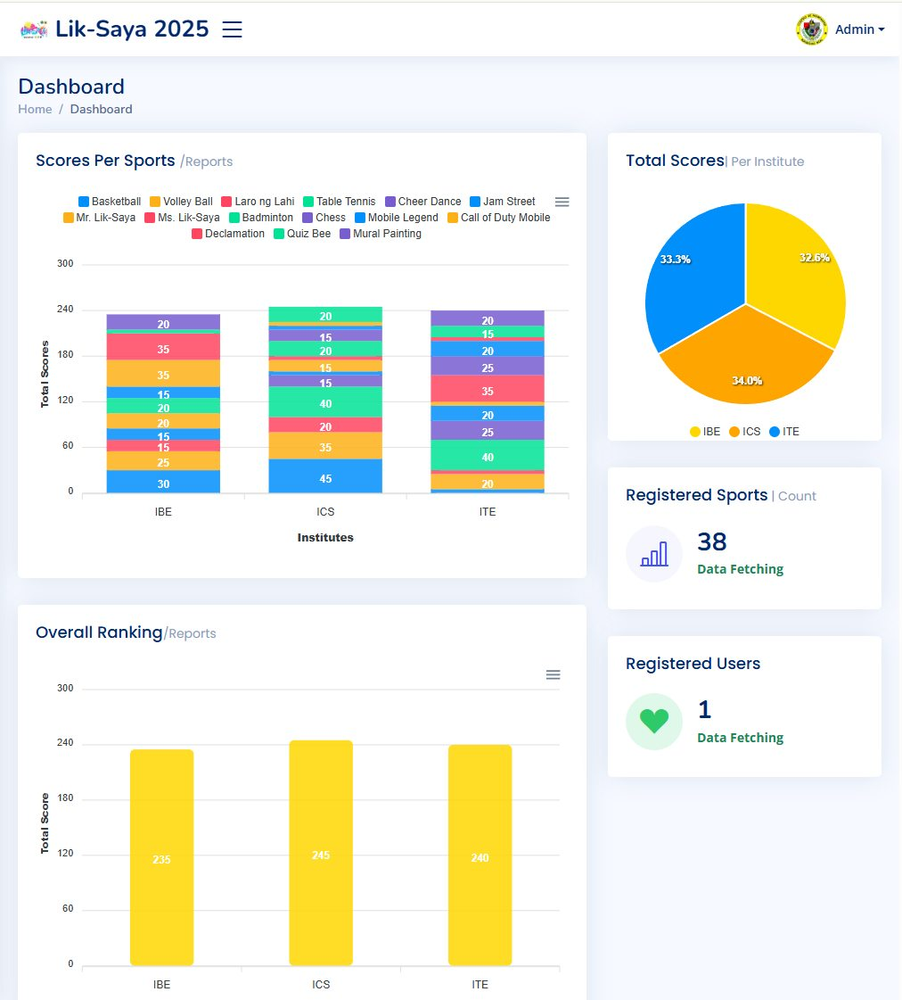 
      <strong>📊 Liksaya Tabulation System</strong>
    </td>
  </tr>
</table>

---

## 🛠️ Developed Applications

| System | Description |
|--------|-------------|
| **🎓 Admission Exam System** | Automates applicant exams, result generation, and applicant management |
| **⛪ Parish Information System** | Handles church records, events, and member information |
| **📱 BYOD App (with SMS OTP)** | Secures and tracks device access using OTP via SMS |
| **🚨 Emergency Response System** | Sends real-time SMS alerts for incidents and emergencies |
| **📅 Events Management System** | Manages institutional event planning and scheduling |
| **👨‍🏫 Faculty Availability System** | Tracks and displays real-time availability of faculty |
| **🏢 General Services Office System** | Monitors inventory and requests for school services |
| **📊 Liksaya Tabulation System** | Tabulates scores during school events or competitions |
| **🛒 Procurement System** | Tracks requisitions, approvals, and purchasing workflow |
| **👑 San Jose Pageant Tabulation** | Calculates and manages pageant results efficiently |
| **🧑‍🎓 Student Information System** | Manages student profiles, academic records, and more |
| **🗂️ Title Defense Tracker App** | Tracks research/project defense schedules and statuses |
| **📦 Inventory System** | Barcode-enabled inventory tracking and stock management |
| **💳 Pilotos POS System** | Point-of-sale system with QR code integration |
| **📁 Jand Inventory System** | Custom inventory solution tailored for local enterprise |
| **📊📁 Faculty Evaluation System** | Faculty Evaluation app with AI recommender, for trainings and seminars |
| **🧑‍💼 CdM HRMS** | Human Resource Management System for Colegio de Montalban |
| **🧾 Wil's Inventory System** | Inventory system with RFID and barcode scanner for employees |
| **☕ Deja Brew Inventory System** | SCM-enabled inventory with barcode scanning support |
| **🏢 Registrar Queueing System** | Manage and Tracks request and inquiries |
| **🖼️ Portrait Selling App** | Manage users portrait designs, Post and Bid |
| **🏪 PoS and Inventory System** | Manage Orders from Kiosk, Set Monthly Sales Tracking |
| **🏛️Blotter System** | Desktop Application with the integration of Fingerprint , Signature pad and Web Camera devices |
| **🏖️Resort Management System** | Progressive Web Application with Sales tracking and Reservation Management |

---

## 🌱 IoT + AI Projects

| Project | Description | Demo |
|--------|-------------|------|
| **👶 Portable Baby Care Box** | Sanitizer box for baby needs built with Raspberry Pi | _[🎥 Watch Demo](https://www.youtube.com/watch?v=EtHmSdz5mVE)|
| **🌿 LoRa Vertical Garden** | Smart hydroponics system using ESP32 and LoRa communication | _[🎥 Coming Soon](https://your-video-link.com/iotwatering) |
| **⌚ SPO2 & Heart Rate Reader** | Watch-style device for vital signs tracking with SMS alerts | _[🎥 Watch Demo](https://www.facebook.com/reel/246212898523480) |
| **💵 Paper Bill Recognition** | Recognizes Philippine paper bills using image processing | _[🎥 Watch Demo](https://www.facebook.com/61556155225037/videos/758532979956549)|
| **🧠 Smart Attendance** | Face recognition with real-time attendance logging | [🎥 Coming Soon](https://your-video-link.com/facerec) |
| **💧 Automated Watering System** | Monitors soil pH/EC and syncs data to the cloud | [🎥 Coming Soon](https://your-video-link.com/iotwatering) |
| **💊 Pill Dispencer** | Prototype that simple sends command from mobile app to esp32 | [🎥 Coming Soon](https://your-video-link.com/iotwatering) |
| **😎 Smart Head Band** | Smart obstacle detection system for blind individuals | [🎥 Coming Soon](https://your-video-link.com/iotwatering) |
| **🛏️ Smart Pillow** | Prototype that monitors user vital signs, such as SPO2, HR, Breathing Rate | [🎥 Coming Soon](https://your-video-link.com/iotwatering) |

---

## 📊 GitHub Stats

  
  

  
  

---

  

---

## 📫 Let’s Connect

- 📧 Email: [jmca.solutions.codewith.me@gmail.com](mailto:jmca.solutions.codewith.me@gmail.com)
- 📘 Facebook: [Jonas Macapagal](https://facebook.com/clydealdrich04)
- 📂 Project Page: [JMCA-SOLUTIONS](https://facebook.com/profile.php?id=61556155225037)

---

> ⚡ **Fun Fact**: I lift dumbbells and debug code with equal passion. 💪🔥
